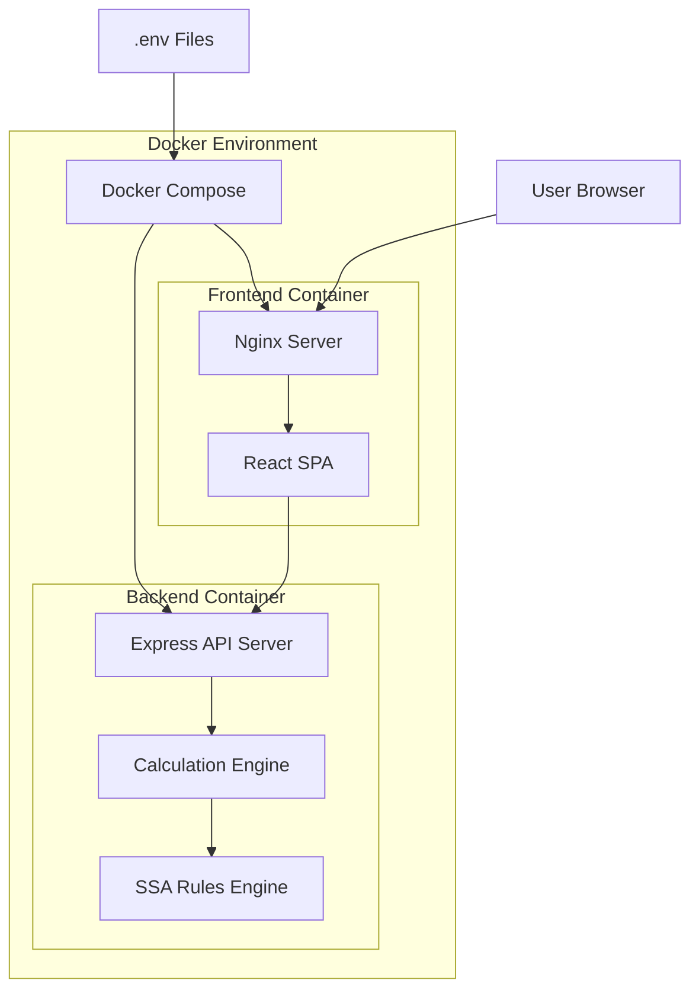

# Design Document

## Overview

The Social Security Benefits Calculator is a full-stack web application built with a modern React frontend and Node.js/Express backend, deployed using Docker containers. The system calculates optimal Social Security claiming strategies using actuarial mathematics and Social Security Administration rules. The architecture emphasizes separation of concerns, testability, and environment-specific configuration.

### Technology Stack

- **Frontend**: React 18+ with TypeScript, Tailwind CSS for styling, Recharts for data visualization
- **Backend**: Node.js with Express, TypeScript
- **Containerization**: Docker and Docker Compose
- **Development**: Vite for fast development builds with hot module replacement
- **Production**: Nginx as reverse proxy and static file server

## Architecture

### System Architecture Diagram



### Container Architecture

**Development Mode:**
- Frontend container runs Vite dev server with HMR on port 5174
- Backend container runs nodemon for auto-restart on port 3002
- Volumes mounted for live code updates
- Environment variables loaded from .env.development

**Production Mode:**
- Frontend container runs Nginx serving optimized static build
- Backend container runs Node.js in production mode
- Multi-stage builds minimize image size
- Environment variables loaded from .env.production
- Health checks enabled for both containers

## Components and Interfaces

### Frontend Components

#### 1. App Component (App.tsx)
- Root component managing application state
- Handles mode switching (individual vs. married couple)
- Coordinates data flow between input and results components

#### 2. CalculatorForm Component
- Collects user inputs (birth date, PIA, life expectancy)
- Provides validation with real-time feedback
- Supports both individual and married couple modes
- Responsive layout with mobile-optimized inputs

**Props Interface:**
```typescript
interface CalculatorFormProps {
  mode: 'individual' | 'couple';
  onCalculate: (data: CalculationInput) => void;
  isLoading: boolean;
}

interface CalculationInput {
  individual?: PersonData;
  spouse1?: PersonData;
  spouse2?: PersonData;
  assumptions: AssumptionData;
}

interface PersonData {
  birthDate: string;
  pia: number;
  lifeExpectancy: number;
}

interface AssumptionData {
  inflationRate: number;
  useInflationAdjusted: boolean;
}
```

#### 3. ResultsDisplay Component
- Shows optimal claiming age recommendation
- Displays monthly benefit amounts
- Presents comparison data
- Responsive card-based layout

#### 4. BenefitsChart Component
- Visualizes lifetime benefits across claiming ages
- Interactive chart with tooltips
- Highlights optimal strategy
- Responsive design for mobile screens
- Uses Recharts library

**Props Interface:**
```typescript
interface BenefitsChartProps {
  data: ChartDataPoint[];
  optimalAge: number;
  mode: 'individual' | 'couple';
}

interface ChartDataPoint {
  age: number;
  monthlyBenefit: number;
  lifetimeBenefit: number;
  cumulativeBenefit: number[];
}
```

#### 5. AssumptionsPanel Component
- Adjustable sliders for life expectancy and inflation
- Shows default values with explanatory tooltips
- Real-time updates trigger recalculation

### Backend API Endpoints

#### POST /api/calculate/individual
Calculates optimal claiming strategy for an individual.

**Request Body:**
```typescript
{
  birthDate: string;        // ISO date format
  pia: number;              // Monthly PIA amount
  lifeExpectancy: number;   // Years
  inflationRate: number;    // Percentage (0-10)
}
```

**Response:**
```typescript
{
  optimalAge: number;
  optimalMonthlyBenefit: number;
  optimalLifetimeBenefit: number;
  strategies: Strategy[];
  chartData: ChartDataPoint[];
}

interface Strategy {
  claimingAge: number;
  monthlyBenefit: number;
  lifetimeBenefit: number;
  adjustmentPercentage: number;
  description: string;
}
```

#### POST /api/calculate/couple
Calculates optimal claiming strategy for a married couple.

**Request Body:**
```typescript
{
  spouse1: PersonData;
  spouse2: PersonData;
  inflationRate: number;
}
```

**Response:**
```typescript
{
  optimalStrategy: CoupleStrategy;
  alternativeStrategies: CoupleStrategy[];
  chartData: CoupleChartData;
}

interface CoupleStrategy {
  spouse1ClaimingAge: number;
  spouse2ClaimingAge: number;
  combinedLifetimeBenefit: number;
  spouse1MonthlyBenefit: number;
  spouse2MonthlyBenefit: number;
  spousalBenefitAmount: number;
  survivorBenefitScenarios: SurvivorScenario[];
  description: string;
}
```

#### GET /api/health
Health check endpoint for container orchestration.

**Response:**
```typescript
{
  status: 'healthy' | 'unhealthy';
  timestamp: string;
  version: string;
}
```

### Backend Services

#### 1. CalculationService
Core service orchestrating benefit calculations.

**Methods:**
```typescript
class CalculationService {
  calculateIndividual(input: IndividualInput): IndividualResult;
  calculateCouple(input: CoupleInput): CoupleResult;
  private validateInput(input: any): ValidationResult;
}
```

#### 2. SSARulesEngine
Implements Social Security Administration rules and formulas.

**Methods:**
```typescript
class SSARulesEngine {
  calculateFRA(birthYear: number): number;
  calculateEarlyReductionPercentage(claimingAge: number, fra: number): number;
  calculateDelayedCredits(claimingAge: number, fra: number): number;
  calculateSpousalBenefit(higherPIA: number, claimingAge: number, fra: number): number;
  calculateSurvivorBenefit(deceasedBenefit: number): number;
  getMonthlyBenefit(pia: number, claimingAge: number, fra: number): number;
}
```

**SSA Rules Implementation:**
- FRA: 66-67 based on birth year (1943-1960+)
- Early claiming reduction: 5/9 of 1% per month for first 36 months, 5/12 of 1% thereafter
- Delayed credits: 2/3 of 1% per month after FRA (8% per year)
- Spousal benefit: 50% of higher earner's PIA at FRA, reduced if claimed early
- Survivor benefit: 100% of deceased spouse's benefit

#### 3. ProjectionService
Calculates lifetime benefit projections.

**Methods:**
```typescript
class ProjectionService {
  projectLifetimeBenefits(
    monthlyBenefit: number,
    claimingAge: number,
    lifeExpectancy: number,
    inflationRate: number
  ): ProjectionResult;
  
  projectCumulativeBenefits(
    monthlyBenefit: number,
    claimingAge: number,
    lifeExpectancy: number
  ): number[];
  
  private applyInflation(amount: number, years: number, rate: number): number;
}
```

## Data Models

### Frontend State Management

```typescript
// Application State
interface AppState {
  mode: 'individual' | 'couple';
  inputData: CalculationInput | null;
  results: CalculationResult | null;
  isLoading: boolean;
  error: string | null;
}

// Calculation Result
interface CalculationResult {
  type: 'individual' | 'couple';
  optimal: OptimalStrategy;
  alternatives: Strategy[];
  chartData: ChartDataPoint[];
  metadata: {
    calculatedAt: string;
    assumptions: AssumptionData;
  };
}
```

### Backend Data Models

```typescript
// Individual Calculation Input
interface IndividualInput {
  birthDate: Date;
  pia: number;
  lifeExpectancy: number;
  inflationRate: number;
}

// Couple Calculation Input
interface CoupleInput {
  spouse1: PersonInput;
  spouse2: PersonInput;
  inflationRate: number;
}

interface PersonInput {
  birthDate: Date;
  pia: number;
  lifeExpectancy: number;
}

// Calculation Result Models
interface StrategyComparison {
  claimingAge: number;
  monthlyBenefit: number;
  lifetimeBenefit: number;
  netPresentValue: number;
  adjustmentFactor: number;
}
```

## Error Handling

### Frontend Error Handling

1. **Input Validation Errors**
   - Display inline validation messages
   - Prevent form submission until valid
   - Highlight invalid fields with red borders

2. **API Communication Errors**
   - Show user-friendly error messages
   - Provide retry mechanism
   - Log errors to console for debugging

3. **Rendering Errors**
   - React Error Boundaries catch component errors
   - Display fallback UI with error message
   - Log stack traces in development mode

### Backend Error Handling

1. **Request Validation Errors**
   - Return 400 Bad Request with detailed validation messages
   - Use middleware for consistent validation

2. **Calculation Errors**
   - Return 422 Unprocessable Entity for invalid calculation scenarios
   - Include helpful error messages

3. **Server Errors**
   - Return 500 Internal Server Error
   - Log full error details
   - Return generic message to client (security)

**Error Response Format:**
```typescript
{
  error: {
    code: string;
    message: string;
    details?: any;
  }
}
```

### Docker Error Handling

1. **Container Health Checks**
   - Backend: HTTP health check on /api/health every 30 seconds
   - Frontend: HTTP check on root path
   - Restart policy: on-failure with max 3 retries

2. **Environment Variable Validation**
   - Validate required variables on startup
   - Fail fast with descriptive error messages
   - Document all required variables in .env.example

## Testing Strategy

### Frontend Testing

1. **Unit Tests**
   - Test calculation logic in utility functions
   - Test component rendering with React Testing Library
   - Test form validation logic
   - Mock API calls

2. **Integration Tests**
   - Test complete user flows (input → calculation → results)
   - Test mode switching
   - Test responsive behavior

3. **Visual Testing**
   - Test responsive layouts at key breakpoints (320px, 768px, 1024px, 1920px)
   - Test chart rendering and interactions
   - Test accessibility with axe-core

### Backend Testing

1. **Unit Tests**
   - Test SSARulesEngine calculations against known values
   - Test ProjectionService formulas
   - Test input validation logic

2. **Integration Tests**
   - Test API endpoints with various input scenarios
   - Test error handling paths
   - Test edge cases (age 62, 70, FRA boundaries)

3. **Calculation Accuracy Tests**
   - Verify against SSA published examples
   - Test boundary conditions
   - Test married couple scenarios

### Docker Testing

1. **Build Tests**
   - Verify multi-stage builds complete successfully
   - Check image sizes are optimized
   - Verify all dependencies are included

2. **Runtime Tests**
   - Test container startup in both dev and prod modes
   - Verify environment variable loading
   - Test health check endpoints
   - Verify volume mounts in development

## UI/UX Design

### Visual Design System

**Color Palette:**
- Primary: #2563eb (Blue 600) - Trust and professionalism
- Secondary: #059669 (Emerald 600) - Positive outcomes
- Accent: #dc2626 (Red 600) - Warnings and important info
- Neutral: Gray scale from 50 to 900
- Background: #f9fafb (Gray 50)

**Typography:**
- Headings: Inter font family, weights 600-700
- Body: Inter font family, weight 400
- Monospace: JetBrains Mono for numbers

**Spacing:**
- Base unit: 4px (Tailwind's spacing scale)
- Component padding: 16-24px
- Section margins: 32-48px

### Responsive Breakpoints

- Mobile: 320px - 767px (single column, stacked layout)
- Tablet: 768px - 1023px (two column where appropriate)
- Desktop: 1024px+ (full multi-column layout)

### Accessibility

- WCAG 2.1 AA compliance
- Semantic HTML elements
- ARIA labels for interactive elements
- Keyboard navigation support
- Focus indicators on all interactive elements
- Screen reader tested

### Mobile Optimizations

- Touch targets minimum 44x44px
- Simplified charts for small screens
- Collapsible sections to reduce scrolling
- Optimized images and lazy loading
- Service worker for offline capability (future enhancement)

## Environment Configuration

### Development Environment (.env.development)

```bash
# Application
NODE_ENV=development
VITE_API_URL=http://localhost:3002

# Backend
PORT=3002
CORS_ORIGIN=http://localhost:5174

# Frontend Dev Server
VITE_PORT=5174
```

### Production Environment (.env.production)

```bash
# Application
NODE_ENV=production
VITE_API_URL=/api

# Backend
PORT=3002
CORS_ORIGIN=https://yourdomain.com

# Security
RATE_LIMIT_WINDOW_MS=900000
RATE_LIMIT_MAX_REQUESTS=100
```

### Docker Compose Configuration

**Development:**
- Volume mounts for hot reloading
- Exposed ports for direct access
- Development-optimized builds

**Production:**
- No volume mounts
- Internal networking only (Nginx as gateway)
- Optimized production builds
- Resource limits defined

## Security Considerations

1. **Input Validation**
   - Sanitize all user inputs
   - Validate data types and ranges
   - Prevent injection attacks

2. **API Security**
   - Rate limiting on API endpoints
   - CORS configuration
   - Helmet.js for security headers

3. **Container Security**
   - Run containers as non-root user
   - Minimal base images (Alpine Linux)
   - No secrets in images or environment variables
   - Regular security updates

4. **Data Privacy**
   - No data persistence (stateless application)
   - No user tracking or analytics by default
   - All calculations performed server-side

## Performance Targets

- Initial page load: < 3 seconds on 4G
- Time to interactive: < 2 seconds
- API response time: < 200ms for calculations
- Chart rendering: < 500ms
- Lighthouse score: > 90 across all categories
